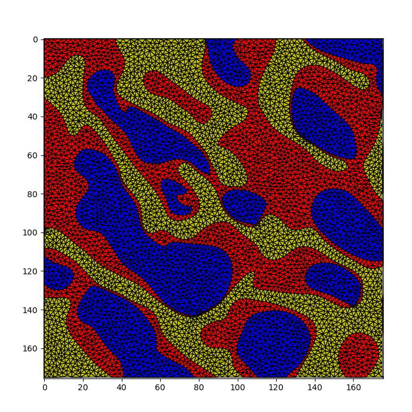

# image-meshing

*Contour-based meshing of the image domain developed for [CINEMAX summer school](https://www.conferencemanager.dk/cinemaxvi).*

Input image | Meshing result `ael=5` | Meshing result `ael=2` 
:---:|:---:|:---:
 |   |  

The module `meshing.py` contains the functionality for contour-based meshing of the image. Image contours are detected using marching squares implementation from the [scikit image package](https://scikit-image.org/). Computing the conforming constrained Delaunay triangulation relies on the functionality from [triangle package](https://rufat.be/triangle/), which in turn wraps around [Jonathan Richard Shewchuk’s mesh generator](http://www.cs.cmu.edu/~quake/triangle.html). 

For 3-phase segmentation check [bone meshing notebook](bone_meshing.ipynb), which is also the best documented notebook among the available notebooks.

For 2-phase segmentation check [bundles meshing notebook](bundles_meshing.ipynb). Chalk and fiber meshing is pretty much the same as for bundles, and bench is an example of meshing an RGB image, by simply converting it to grayscale. 
