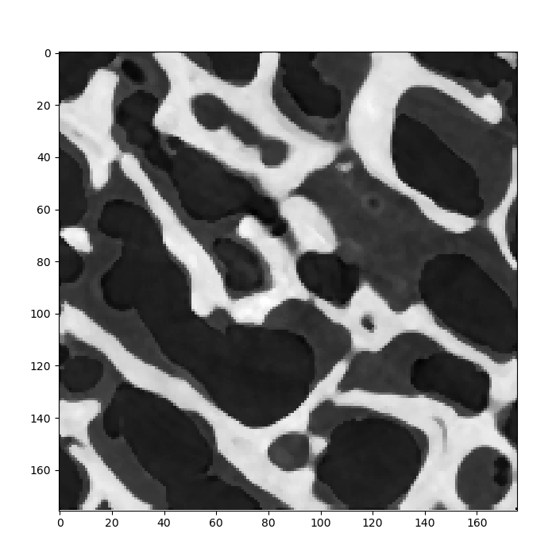
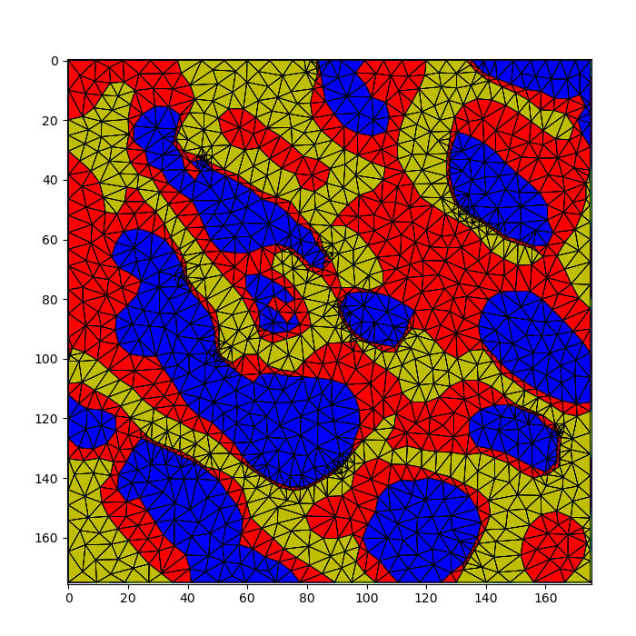

# image-meshing

*Contour-based meshing of the image domain developed for CINEMAX summer school.*

Input image | Meshing result 
:---:|:---:
 |  

The module `meshing.py` contains the functionality for contour-based meshing of the image. Contour detection uses marching squares implementation from the [scikit image package](https://scikit-image.org/). For computing the conforming constrained Delaunay triangulation we rely on the functionality from [triangle package](https://rufat.be/triangle/), which in turn wraps around [Jonathan Richard Shewchuk’s mesh generator](http://www.cs.cmu.edu/~quake/triangle.html). 

For 3-phase segmentation check [bone meshing notebook](bone_meshing.ipynb), which is also the most documented meshing notebook.

For 2-phase segmentation check [bundles meshing notebook](bundles_meshing.ipynb). Chalk and fiber meshing is pretty much the same as bundles, and bench is an example of meshing an rgb image, by simply converting it to grayscale. 
